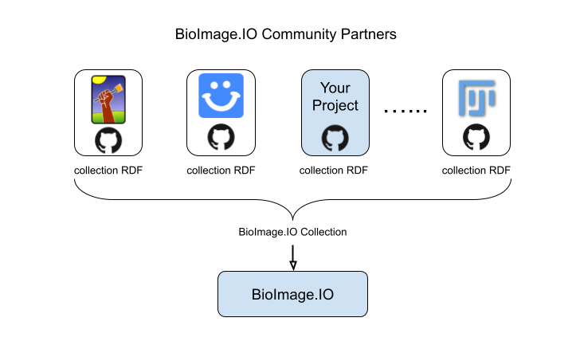

# Join as a community partner

BioImage.IO is a community-driven open source initiative, providing access to trained deep learning models and related resources contributed by the community members. To help us better disseminate and maintain the resources, we introduced the concepts of **community partner**. 

## What is a community partner?
Usually, a community partner is an organization, a company, a research group, or a software team (of one or more) that can consume and/or produce resources of the BioImage.Io model zoo. Additionally, most partners continuously and openly contribute resources of their own. The first community partners represent open source consumer software of BioImage.IO (e.g. ilastik, Fiji, deepImageJ, ZeroCostDL4Mic, StarDist).

### Benefits as a community partner
By joining BioImage.IO as a community partner, you will be able to:
 - Participate in decision making process of the model specification.
 - Show your logo in BioImage.IO and enable filtering models by compatibility with your software.
 - Connect CI to automatically test new model compatibility with your software and use other infrastructure features provided by BioImage.IO.
 
### Responsibilities
The main responsibilities of a community partner are:
 - Use BioImage.IO as their only primary trained model repository.
 - Review resources contributed by others that claim to be compatible with this community partner software.
 - Maintain this community partner's models and other resources in their linked repository, setup continous integration workflows to test models and keep them up-to-date with the latest spec.
 
### Who should join as a community partner?
 * A team behind a software which produces or consumes trained models compatible with the BioImage.IO spec.
 * A organization, group, company or team (of one or more) who contributed and will keep contributing more models to BioImage.IO.

## How does it work?
Community partners can host their own Github repository for storing models and other resources that are relevant. These resources are listed in a [collection RDF](https://github.com/bioimage-io/spec-bioimage-io/blob/gh-pages/collection_spec_latest.md)–a yaml file–which will be dynamically linked to the [central repository of BioImage.IO](https://github.com/bioimage-io/bioimage-io-models). The [continuous integration (CI) service](https://github.com/bioimage-io/bioimage-io-models/actions) configured in the central repo will then pull the resources from partners' repo and compile them into items displayed in the BioImage.IO website. Each community partner is responsible for maintaining the resources that are relevant. 




## How to setup CI in the community partner repository
See more information here: https://github.com/bioimage-io/collection-bioimage-io#contribute-resource-test-summaries


## Report User Analytics

Community partners can use our user analytics service to report resource downloads and access to statistics.

See [User Analytics](/community_partners/user_analytics.md) for more details.

## Meet our Community Partners
Below is a list of our esteemed Community Partners who actively engage with the BioImage Model Zoo project, contributing their expertise, resources, and support to enhance the bioimage analysis community.

<!-- ImJoyPlugin: {"type": "window"} -->
```html
<config lang="json">
{
  "name": "BioImageIO Community Partners",
  "type": "window",
  "tags": [],
  "ui": "",
  "version": "0.1.0",
  "cover": "",
  "description": "Create a table for the bioimage.io community partners",
  "icon": "extension",
  "inputs": null,
  "outputs": null,
  "api_version": "0.1.8",
  "env": "",
  "permissions": [],
  "requirements": ["https://cdnjs.cloudflare.com/ajax/libs/react/17.0.2/umd/react.production.min.js", "https://cdnjs.cloudflare.com/ajax/libs/react-dom/17.0.2/umd/react-dom.production.min.js", "https://cdnjs.cloudflare.com/ajax/libs/babel-standalone/6.26.0/babel.min.js", "https://cdn.tailwindcss.com"],
  "dependencies": [],
  "defaults": {"w": 20, "h": 10}
}
</config>

<attachment name="react-src">
// Main React App Component
const App = () => {
  const [partners, setPartners] = React.useState([]);

  // Fetch JSON data from the URL
  React.useEffect(() => {
    fetch('https://raw.githubusercontent.com/bioimage-io/collection-bioimage-io/gh-pages/collection.json')
      .then(response => response.json())
      .then(data => {
        if (data.config && data.config.partners) {
          setPartners(data.config.partners);
        } else {
          setPartners([]);
        }
      })
      .catch(err => console.error(err));
  }, []);

  return (
    <div className="flex flex-col justify-center items-center min-h-screen bg-gray-100 text-gray-800 w-full">
      <div className="p-8 bg-white shadow-md rounded-lg w-full h-full">
        <h1 className="text-2xl font-bold mb-4">Community Partners</h1>
        <table className="min-w-full bg-white w-full h-full">
          <thead className="bg-gray-800 text-white">
            <tr>
              <th className="py-2">Community Partner</th>
              <th className="py-2">Documentation</th>
              <th className="py-2">Contact</th>
            </tr>
          </thead>
          <tbody className="text-gray-700">
            {partners.map((partner, index) => (
              <tr key={index}>
                <td className="py-2 px-4">{partner.name || 'N/A'}</td>
                <td className="py-2 px-4">{partner.docs || 'N/A'}</td>
                <td className="py-2 px-4">
                  {partner.contact ? (
                    partner.contact.map((contact, i) => (
                      <div key={i}>
                        <div>Name: {contact.name || 'N/A'}</div>
                        <div>Github: {contact.github || 'N/A'}</div>
                        <div>Email: {contact.email || 'N/A'}</div>
                      </div>
                    ))
                  ) : (
                    'N/A'
                  )}
                </td>
              </tr>
            ))}
          </tbody>
        </table>
      </div>
    </div>
  );
};

// Render the App component
ReactDOM.render(<App />, document.getElementById('root'));

</attachment>
<script lang="javascript">
async function loadBabelScript(content) {
  return new Promise((resolve, reject) => {
      const script = document.createElement('script');
      script.type = 'text/babel';
      script.setAttribute('data-presets', 'react');
      script.textContent = content;
      script.onerror = function() {
        reject(new Error('Failed to load the Babel script.'));
      };
      document.head.appendChild(script);
      setTimeout(()=>{
        try{
            Babel.transformScriptTags();
            resolve('Babel script has been loaded!');
         } catch (error) {
          reject(error);
        }
      }, 0);
  });
}
    
class ImJoyPlugin {
  async setup() {
    await api.log('initialized')
  }

  async loadJsxScript(script){
      await loadBabelScript(script);
  }

  async run(ctx) {
    if(ctx.data && ctx.data.jsx_script)
      await loadBabelScript(ctx.data.jsx_script);
    else
      await loadBabelScript(await api.getAttachment('react-src'));
  }
}

api.export(new ImJoyPlugin())
</script>

<window lang="html">
<div id="root"></div>
</window>

<style lang="css">
</style>
```


| Tool Name      | WebPage                                   | Main Contact Person        | Institution                                 | Documentation                  |
| -------------- | ----------------------------------------- | --------------------------- | ------------------------------------------- | ------------------------------ |
| ZeroCostDL4Mic | [GitHub](https://github.com/HenriquesLab/ZeroCostDL4Mic) | Ricardo Henriques and Guillaume Jacquemet | [UTU](https://www.utu.fi/en) and [Abo Akademi](https://www.abo.fi)      | [Wiki](https://github.com/HenriquesLab/ZeroCostDL4Mic/wiki) |
| DeepImageJ     | [Website](https://deepimagej.github.io)   | Arrate Muñoz Barrutia      | [UC3M](https://www.uc3m.es/home) and [EPFL](https://www.epfl.ch/en/) | [Wiki](https://github.com/deepimagej/deepimagej-plugin/wiki) |
| ImJoy          | [Website](https://imjoy.io/#/)            | Wei Ouyang                 | [KTH](https://www.kth.se/en)              | [Docs](https://imjoy.io/docs/#/) |
| Ilastik        | [Website](https://www.ilastik.org)       | Anna Kreshuk               | [EMBL](https://www.embl.org)             | [Docs](https://www.ilastik.org/documentation/index.html) |
| icy            | [Website](https://icy.bioimageanalysis.org) | Jean-Christophe Olivo Marin | [IP](https://www.pasteur.fr/en)           | -                              |
| Fiji           | [Website](https://fiji.sc)                | Florian Jug                | -                                           | [Docs](https://imagej.net/software/fiji/) |
| HPA            | [Model Zoo](https://modelzoo.cellprofiling.org/#/) | Frederic Ballllosera Navarro           | [KTH](https://www.kth.se/en) and [Stanford](https://stanford.edu)             | -                              |
| QuPath         | [Website](https://qupath.github.io)       | Pete Bankhead              | [UoE](https://www.ed.ac.uk)              | [Docs](https://qupath.readthedocs.io/en/stable/) |
| StarDist       | [Website](https://stardist.net)           | Uwe Schmidt and Martin Weigert | -                                    | [GitHub](https://github.com/stardist/stardist) |


